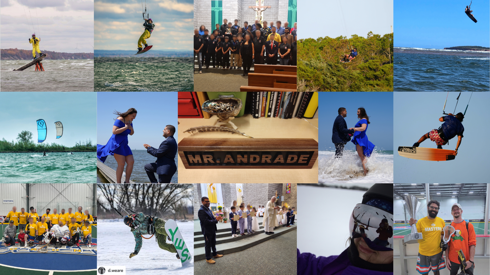
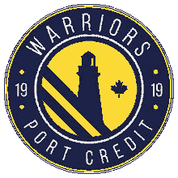
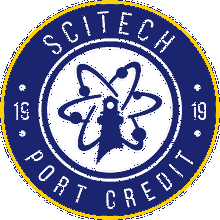
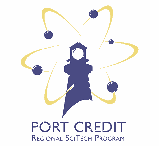

:::::: {.bs-page-shell}
::::: {.bs-reading-column}

::: {.ter-about-intro}
::: {.ter-about-portrait}
{fig-alt="Collage of Andrew Andrade teaching, technology, sport, and community activities" loading="lazy"}
:::

::: {.ter-about-intro-copy}
## Hi, I'm Andrew Andrade, B.A.Sc., B.Ed., OCT.

I teach Technological Education at Port Credit Secondary School. I am still learning how to do this work well. Teaching and learning are not only about content; they are about living the experiences through which knowledge becomes skill, judgement, and practical wisdom. Content and knowledge give us language, tools, reference points, and ways to make better decisions, but the aim is growing capability, depth of practice, and the ability to live a good life with what we learn. This site gathers the content, examples, experiments, assignments, slides, and revisions so other people can find them, adapt them, learn through doing, and follow the way in their own work.

The resources are organized around Ontario's [Technological Education curriculum](https://www.dcp.edu.gov.on.ca/en/curriculum/technological-education), with connections to other curricular and co-curricular learning where they are useful. Transportation resources can also support Ontario's [Specialist High Skills Major (SHSM) in Transportation](https://www.ontario.ca/document/specialist-high-skills-major-shsm-policy-and-implementation-guide/transportation), including sector-focused learning, certifications, experiential learning, career exploration, reach-ahead experiences, and sector-partnered experiences.
:::
:::

::: {.callout-note}
## Work in progress and public contributions

This site is a living collection of teaching materials. It may contain errors, omissions, outdated information, and areas with significant room for improvement. If you find something that can be corrected or improved, please [open an issue](https://github.com/mrandrewandrade/tech-edu-resources/issues) or [submit a pull request](https://github.com/mrandrewandrade/tech-edu-resources/pulls).

The GitHub repository, issues, pull requests, comments, and commit history are public. **Do not post student information, personal information, confidential school or board information, account information, or other sensitive material.** Review and redact your contribution before publishing it. Contributors are responsible for the information they choose to place in a public GitHub contribution; this project cannot protect information that someone has chosen to publish publicly.
:::

## A little background

Before teaching at Port Credit, I worked at Palantir, ran a startup called PetroPredict, and completed internships at Facebook, Suncor, and several smaller technology companies. Earlier, while I was still in high school, I worked as a lifeguard and deck supervisor with the City of Mississauga and in a machine shop after a co-op placement.

Outside work and school, I was a sponsored kiteboarder for **Switch Kites** and have been an avid **box lacrosse** player. Kiteboarding was a major part of my life and shaped how I think about practice, judgement, risk, feedback, equipment, weather, failure, and learning from people who have different skills, knowledge, and wisdom from you.

After moving back to Mississauga following time living abroad, kiteboarding became something I could realistically do only a few times a year. I needed other ways to keep learning with people, contributing to communities, and doing things that require practice.

I now volunteer, guest speak, and run workshops with a variety of organizations, but I spend the most time contributing to my local parish in Mississauga. I am of **Goan Catholic heritage**, and I have helped with children's programs including First Holy Communion and with liturgy involving exceptional individuals.

I take my own beliefs seriously while also trying to study other philosophies and religious traditions with respect. That helps me understand more of the people I teach and work with, and gives me more ways to think about learning, discipline, community, service, attention, and human well-being. More recently, I have been training in **Gong Fu and Qigong** with the [Chung Wah Kung Fu International System](https://www.chungwahkungfu.com/) and the [Human Wellness and Recuperation Centre](https://www.chungwahhealth.com/).

## Why this is open-source and free

The goal is simple: useful teaching and learning material is **open-source, free to access, and easy to adapt**. Learners, educators, and anyone else who can use it can access basic knowledge without a paywall or dependence on a single classroom, platform, or account.

This approach is influenced by open education projects such as Tony R. Kuphaldt's [Socratic Electronics](https://www.ibiblio.org/kuphaldt/socratic/), which emphasizes learning through questions, research, discussion, explaining ideas to others, and developing the ability to teach yourself.

The material here is meant to be used, questioned, adapted, improved, and shared again.

## A few ideas worth carrying

These are not meant to collapse different religions or philosophies into one system. They are short ideas I find useful to keep nearby when thinking about teaching, learning, practice, and community.

- **Paul Cormier / Indigenous learning methodology:** [**Kinoo'amaadawaad Megwaa Doodamawaad**](https://www.lakeheadu.ca/users/C/pcormier), translated by Cormier as **“they are learning with each other while they are doing.”** I want that idea to shape these notes: students learn with one another while doing real work, and the documentation grows from that work.
- **Confucianism:** [learn something, then practise it](https://confucius-analects.org/en/books/01/01/). Learning is not complete when something has merely been heard or read.
- **Daoism:** [a long journey begins beneath your feet](https://taoism.net/tao-te-ching-chapter-64/). Large work starts from what is small and present, and care at the end matters as much as enthusiasm at the beginning.
- **The Way:** I use *the Way* here in a broad, non-doctrinal sense: being present with things as they are, without judgement, and letting the path become clearer through practice. The focus is on being rather than constantly reaching for the next outcome: doing one thing mindfully, acting effectively, accepting what is present, and working without attachment to a particular result. This also connects to well-being as something lived and practised across the physical, mental, spiritual, and emotional parts of a person. Different traditions use the idea of a way or path differently, and those differences matter.
- **Spirit:** Spirit can describe something carried within a person, but also something strengthened between people: school spirit, team spirit, community spirit. It can grow through belonging, responsibility, shared effort, service, and the feeling that your work is connected to something larger than yourself.
- **Stoicism:** Epictetus treats education as more than book knowledge; character and judgement are developed through [repeated practice and self-correction](https://plato.stanford.edu/entries/epictetus/).
- **Epicureanism:** Epicurus places unusual weight on [friendship as part of a good life](https://www.zhaibian.com/quotes/epicurus-on-friendship). Learning is easier to sustain when people enjoy doing worthwhile things together.
- **Hindu tradition:** the [Bhagavad Gita 2:47](https://www.bhagavadgita.fyi/chapter/2/verse/47/) distinguishes action from attachment to its results: do the work carefully without letting the outcome become the only reason for doing it.
- **Buddhism:** the [Dhammapada 76](https://84000.org/tipitaka/english/metta.lk/25i016-e1.php) compares a wise person who points out your faults to someone revealing hidden treasure. Good correction can be a gift.
- **Jewish tradition:** [Pirkei Avot 4:1](https://voices.sefaria.org/sheets/383117) asks, “Who is wise?” and answers: the person who learns from every person.
- **Christian tradition:** [“Iron sharpens iron”](https://www.biblegateway.com/passage/?search=Proverbs%2027%3A17) is a useful image for people improving one another through honest contact, practice, challenge, and care.
- **Islamic learning tradition:** [“Seek knowledge from the cradle to the grave”](https://hadithnotes.org/1299/) is a widely repeated educational maxim. It is worth carrying for its meaning, while being careful not to present it as a verified Prophetic hadith. The Qur'an also gives the concise prayer, [“My Lord, increase me in knowledge”](https://quran.com/20/114).
- **Ubuntu:** **“A person is a person through other persons.”** The idea of *umuntu ngumuntu ngabantu* keeps learning connected to relationship, dignity, and community.
- **“Each one, teach one.”** Knowledge becomes more useful when it moves through people instead of stopping with the first person who receives it.
- **OSSTF/FEESO:** [“Let us not take thought for our separate interests, but let us help one another.”](https://www.osstf.on.ca/en-CA/about-us/what-we-stand-for/principles.aspx)
- **Port Credit:** **Lux numquam desit.** Let light never be lacking. For this project, that means keeping useful knowledge moving forward.

The common thread is not that these traditions are identical. It is that many very different traditions take practice, humility, relationship, disciplined attention, service, and lifelong learning seriously.

The religious, spiritual, philosophical, and cultural references above describe ideas I study and influences I find useful. They are **not belief requirements for students**. Students are not expected to adopt, reject, defend, or disclose a religious, spiritual, Indigenous, philosophical, or non-religious belief. Classroom reflection can remain secular and can use interests, projects, community, culture, technical work, or another non-sensitive point of reference. Agreement with a belief is never assessed.

## Open licences and attribution

Original educational text, lessons, diagrams, slides, and explanatory material on this site are released under **[Creative Commons Attribution-ShareAlike 4.0](https://creativecommons.org/licenses/by-sa/4.0/)**.

**Share, adapt, and pass it on.** You may copy, modify, remix, and redistribute the original educational material under **CC BY-SA 4.0**. Any modified or adapted version of that material must remain under the **same CC BY-SA 4.0 licence**, identify that changes were made, and preserve attribution to the original source:

- [andrewandrade.ca](https://andrewandrade.ca/)
- [github.com/mrandrewandrade](https://github.com/mrandrewandrade)

When you modify or adapt the work, you can also add **your own name, website, repository, and links** so later versions can credit your contribution too. Each version can carry the people who improved it forward while keeping the original attribution and open licence intact. Because adaptations remain under the same share-alike licence, the work remains shareable and adaptable as it changes. **Sharing is caring.**

A useful attribution is:

> Based on **Technological Education Resources** by Andrew Andrade and contributors, originally published at **andrewandrade.ca** with source at **github.com/mrandrewandrade**. Licensed under **CC BY-SA 4.0**. Modified by **[your name]**, **[your link]**. Changes were made.

Original website code, scripts, build tooling, and other executable materials are released under the **[GNU Affero General Public License v3](https://www.gnu.org/licenses/agpl-3.0.html)**. In plain language, the AGPL lets people use, study, modify, and redistribute the code. If someone distributes a modified version, or runs a modified version as a network service that other people interact with, they must make the corresponding source code available under the same AGPL licence. It is a copyleft licence intended to keep shared software and improvements to it open.

Third-party images, quotations, fonts, logos, and other materials keep their own licences and attribution requirements. The [Licensing and Attribution](licensing.qmd) page has the fuller details.

## Continuing a tradition of teachers sharing

This site is partly an attempt to continue a tradition I benefited from long before I became a teacher: educators making useful material available to people they may never meet.

[**Michael Franzen**](https://ca.linkedin.com/in/qprof) maintained a site that was extremely useful to me during teachers college. That site is now offline, but the example stayed with me: a teacher could put useful technical material on the open web and someone outside their classroom could learn from it.

[**Peter Beens**](https://ca.linkedin.com/in/peter-beens) has likewise shared a substantial body of educational and technical material through [peter.beens.ca](https://peter.beens.ca/), [beens.org](https://www.beens.org/), and [Beens Consulting](https://beensconsulting.com/).

I also owe a great deal to the technology team at **Westdale Secondary School**, who shared an enormous amount of material, experience, and practical advice:

- **Taylor Wilson**: computer and transportation technology
- **Dave Kipp**: construction and woodworking
- **David Christie**: mathematics, science, and general technology
- **Craig Ramsden**: construction and woodworking
- **Rejean Royer**: transportation technology
- **Principal Brian Goodram**

The wooden **MR. ANDRADE** name tag shown in this project was made and gifted to me by teachers at Westdale. Rejean also shared with me parts of his Indigenous heritage and his practice of smudging as part of his daily life. I am grateful for the trust involved in sharing both technical knowledge and personal tradition.

This project is meant to carry that spirit forward: take what is useful, credit the people who helped, improve it where you can, and leave something behind for the next person.

## Contributors

This project currently reflects my classroom work and the people whose ideas, feedback, and resources have influenced it. As others contribute directly to the site, **contributor bios will be added here**.

[LinkedIn](https://www.linkedin.com/in/andrewandrade) · [GitHub](https://github.com/mrandrewandrade) · [Personal site](https://andrewandrade.ca/)

## Port Credit roots

Technological Education Resources is built for teaching at Port Credit Secondary School, and its visual identity deliberately connects to the school without trying to replace the school's own identity.

Port Credit's secondary-school history reaches back to **1919**, when a continuation school opened in the community. The PCSS Alumni Association preserves school history, yearbooks, memorabilia, and stories while supporting scholarships and selected school projects.

The **Regional SciTech Program launched in September 2005**. Alumni material describes it as an integrated science and technology program intended for both inquiry-oriented academic learners and hands-on learners interested in college, apprenticeships, skilled trades, and industry.

The school motto, **Lux numquam desit**, is a natural fit for a visual system built around the Port Credit lighthouse, learning, and the idea of carrying useful knowledge forward.

Technological Education Resources also recognizes the **Mississaugas of the Credit First Nation** and the Indigenous history and continuing stewardship connected to this place. Purple and orange are included in the working palette as community and reflection accents that can be used thoughtfully in Indigenous learning and reconciliation contexts. They are project colours, not presented as official colours of the Mississaugas of the Credit First Nation.

- [PCSS Alumni Association](https://www.pcssalumni.com/)
- [PCSS Alumni - School Programs and SciTech history](https://www.pcssalumni.com/school-programs/)
- [PCSS Alumni - Yearbook archive information](https://www.pcssalumni.com/yearbooks-on-cd/)
- [1960 yearbook history of Port Credit High School](https://www.pcssalumni.com/PDF/YB-1960.pdf)
- [Mississaugas of the Credit First Nation](https://mncfn.ca/)

## Brand system

The Technological Education Resources palette is built from colours inspired by Port Credit, the harbour, the Credit River, school technology programs, and community work.

That means the everyday palette stays warm, quiet, and restrained: deep navy instead of black, ivory instead of cold grey, copper instead of bright orange, and muted blue, green, gold, plum, and red accents instead of highly saturated colours.

Exact colours sampled from supplied PCSS and SciTech marks are kept separately as **source colours**. Those source colours belong to the logos and historical references. They do not need to become the normal interface or document colours for this project.

### Core palette

These are the foundation colours. Most pages, slides, handouts, diagrams, and interfaces should be built primarily from this family.

::: {.brand-swatch-grid}
::: {.brand-swatch style="--swatch:#11182F"}

**Lighthouse Ink**  
`#11182F`
:::

::: {.brand-swatch style="--swatch:#1B2040"}

**Harbour Navy**  
`#1B2040`
:::

::: {.brand-swatch style="--swatch:#39415F"}

**Breakwater Slate**  
`#39415F`
:::

::: {.brand-swatch style="--swatch:#5F626E"}

**Pier Grey**  
`#5F626E`
:::

::: {.brand-swatch style="--swatch:#88786E"}

**Stone**  
`#88786E`
:::

::: {.brand-swatch style="--swatch:#D9CCC0"}

**Sandbar**  
`#D9CCC0`
:::

::: {.brand-swatch style="--swatch:#F3E8DC"}

**Harbour Ivory**  
`#F3E8DC`
:::

::: {.brand-swatch style="--swatch:#FAF7F2"}

**Sail White**  
`#FAF7F2`
:::

::: {.brand-swatch style="--swatch:#FFFDFC"}

**Canvas White**  
`#FFFDFC`
:::
:::

### Harbour blues

Blue still connects the system to Port Credit and SciTech, but the working blues are deliberately muted so they sit comfortably beside navy, ivory, and copper.

::: {.brand-swatch-grid}
::: {.brand-swatch style="--swatch:#1B2040"}

**Port Credit Navy**  
`#1B2040`
:::

::: {.brand-swatch style="--swatch:#30375E"}

**SciTech Navy**  
`#30375E`
:::

::: {.brand-swatch style="--swatch:#3D5F87"}

**Harbour Blue**  
`#3D5F87`
:::

::: {.brand-swatch style="--swatch:#5A748C"}

**Lake Blue**  
`#5A748C`
:::

::: {.brand-swatch style="--swatch:#466A7D"}

**Technical Blue**  
`#466A7D`
:::

::: {.brand-swatch style="--swatch:#D9E2E4"}

**Winter Sky**  
`#D9E2E4`
:::
:::

### Well-being and shoreline greens

Green is for well-being, reflection, positive progress, environmental themes, and calmer technical material. These colours remain earthy rather than bright.

::: {.brand-swatch-grid}
::: {.brand-swatch style="--swatch:#2F6B4F"}

**Evergreen**  
`#2F6B4F`
:::

::: {.brand-swatch style="--swatch:#4F6B46"}

**Credit River Moss**  
`#4F6B46`
:::

::: {.brand-swatch style="--swatch:#7E9474"}

**Sage**  
`#7E9474`
:::

::: {.brand-swatch style="--swatch:#A8BDB2"}

**Sea Glass**  
`#A8BDB2`
:::

::: {.brand-swatch style="--swatch:#E4ECE5"}

**Calm Mint**  
`#E4ECE5`
:::
:::

### Copper, brass, and warm gold

The warm-metal family carries most of the accent work that bright school yellow or orange previously did. Copper is the primary accent because it provides a warm industrial counterpoint to the blues, greens, ivory, and school golds.

::: {.brand-swatch-grid}
::: {.brand-swatch style="--swatch:#915634"}

**Dark Copper**  
`#915634`
:::

::: {.brand-swatch style="--swatch:#AC7652"}

**Copper**  
`#AC7652`
:::

::: {.brand-swatch style="--swatch:#8A6A25"}

**Brass**  
`#8A6A25`
:::

::: {.brand-swatch style="--swatch:#C39A48"}

**Warm Gold**  
`#C39A48`
:::
:::

### Utility and community accents

These colours add energy or meaning without leaving the warm family. Use them as accents rather than large page backgrounds.

::: {.brand-swatch-grid}
::: {.brand-swatch style="--swatch:#A7611B"}

**Signal Amber**  
`#A7611B`
:::

::: {.brand-swatch style="--swatch:#A85A2A"}

**Burnt Orange**  
`#A85A2A`
:::

::: {.brand-swatch style="--swatch:#B7683A"}

**Clay Orange**  
`#B7683A`
:::

::: {.brand-swatch style="--swatch:#C57944"}

**Sunrise Orange**  
`#C57944`
:::

::: {.brand-swatch style="--swatch:#6B536D"}

**Community Plum**  
`#6B536D`
:::

::: {.brand-swatch style="--swatch:#5B455F"}

**Deep Plum**  
`#5B455F`
:::
:::

### Important and alert accents

Red remains uncommon so it keeps its meaning for deadlines, hazards, errors, and genuinely important emphasis.

::: {.brand-swatch-grid}
::: {.brand-swatch style="--swatch:#923B45"}

**Beacon Red**  
`#923B45`
:::

::: {.brand-swatch style="--swatch:#A54C35"}

**Mistake Clay**  
`#A54C35`
:::
:::

### Source colours from supplied PCSS marks

These values are retained for faithful reproduction and documentation of the supplied school marks. They are **reference colours, not the default Technological Education Resources working palette**. The logos themselves should not be recoloured just to force them into the working palette.

| Source mark | Blue | Yellow / gold |
|---|---|---|
| Warriors roundel | `#1D2347` | `#FCD937` |
| Newer SciTech roundel | `#19226D` | `#FFCF01` |
| Older Regional SciTech mark | `#464780` | `#F0DB7C` |

### Recommended combinations

| Mode | Use |
|---|---|
| **Core palette** | Lighthouse Ink + Sail White + Copper |
| **Port Credit** | Port Credit Navy + Sail White + Warm Gold + Copper |
| **SciTech** | SciTech Navy + Harbour Blue + Sail White + Warm Gold |
| **Technical** | Lighthouse Ink + Sail White + Harbour Blue + Copper |
| **Well-being** | Harbour Navy + Sail White + Evergreen + Sea Glass |
| **Community / reflection** | Harbour Navy + Sail White + Community Plum + Sunrise Orange |
| **Warm utility** | Harbour Navy + Harbour Ivory + Signal Amber + Dark Copper |
| **Urgent / important** | Lighthouse Ink + Sail White + Beacon Red, used sparingly |

A page or slide should normally use one mode, not the full palette at once. **Lux numquam desit** can act as a useful guiding idea: keep the design clear enough that the important information is never lost.

## Logos and downloads

The logo files below are collected here so teachers and students have clean working copies without needing to search the web or pull images from screenshots. Some marks are current, some are historical, and some were recreated locally. We will keep improving the provenance notes as better source files are confirmed.

::: {.brand-logo-grid}
::: {.brand-logo-card}
{fig-alt="Port Credit Warriors lighthouse badge"}

### Port Credit Warriors

Current sports-style lighthouse roundel from the supplied PCSS collection.

[Download PNG](assets/branding/pcss/pcss-warriors.png)
:::

::: {.brand-logo-card}
{fig-alt="Circular Port Credit SciTech lighthouse and atom badge"}

### SciTech roundel

Newer circular SciTech treatment with lighthouse and atom imagery.

[Download PNG](assets/branding/pcss/pcss-scitech-badge.png)
:::

::: {.brand-logo-card}
{fig-alt="Port Credit Regional SciTech Program lighthouse and atom mark"}

### Regional SciTech

Regional program mark from the supplied PCSS files.

[Download PNG](assets/branding/pcss/pcss-scitech-regional.png)
:::

::: {.brand-logo-card}
{fig-alt="Legacy Port Credit SciTech logo"}

### Legacy SciTech

Older treatment retained for historical material and design-history reference.

[Download PNG](assets/branding/pcss/pcss-scitech-legacy.png)
:::
:::

### Logo use

Keep the supplied proportions and colours. Do not stretch, skew, add effects, or casually recolour school marks. When possible, use transparent source files rather than extracting logos from screenshots.

Technological Education Resources can sit beside these marks without implying that every page or resource is an official publication of Port Credit Secondary School or the Peel District School Board.

## Well-being, mindfulness, and professional boundaries

Mindfulness and well-being activities on this site are **educational classroom practices, not therapy, counselling, diagnosis, or mental-health treatment**. They may appear as brief start-up activities, pauses, check-ins, or reflections that support attention, self-regulation, readiness to learn, reflection, and awareness of physical, mental, spiritual, and emotional well-being. They sit alongside and around the curriculum as part of the learning environment rather than as therapeutic assignments.

These activities fit the promotion end of PDSB's tiered mental-health model. PDSB's **2026-2029 Mental Health and Addictions Strategy** describes Tier 1 as positive mental-health and well-being promotion for all students through inclusive learning environments, social-emotional learning, and stigma reduction. Specialized consultation, assessment, family support, and therapeutic services sit at Tier 3 with appropriate mental-health professionals. The public [PDSB Mental Health and Well-Being](https://www.peelschools.org/mental-health-and-well-being) page is the starting point for current board resources and pathways to care.

Students are not asked to diagnose themselves or others, disclose private mental-health information, or participate in therapy as coursework. Personal disclosure, emotional intensity, or the private details of a student's life are not a basis for assessment. Where reflection is assessed, the evidence is the curriculum learning or observable learning process identified in the task, not a student's mental-health status or willingness to reveal personal information.

### Referral and pathways to care

If a student asks for mental-health help, or a concern moves beyond ordinary classroom support, the role moves from classroom learning to connection and referral. Depending on the situation, that pathway can include **Guidance or Student Services, school administration, the School Support Team, PDSB social work or psychology services, parents or caregivers, and community or regulated health professionals**. PDSB's current strategy calls for clear pathways to both school and community supports.

The teacher's role is to notice, listen, respond appropriately, maintain professional boundaries, reduce stigma, and connect students with the people whose role and training fit the concern. It does not include diagnosing a condition or providing treatment. This reflects the Ontario College of Teachers' [Supporting Students' Mental Health](https://www.oct.ca/en-ca/for-members/professional-advisories/supporting-students-mental-health) advisory, including its direction to observe, listen, inform, and involve others rather than counsel outside the educator's role and training.

Students are not promised absolute confidentiality. When safety, suspected abuse or neglect, self-harm, threats, or another reporting obligation is involved, applicable school and board procedures, emergency protocols, and the OCT [Duty to Report](https://www.oct.ca/en-ca/for-members/professional-advisories/duty-to-report) advisory govern the response. Professional relationships and communications also follow the OCT [Professional Boundaries](https://www.oct.ca/en-ca/for-members/professional-advisories/professional-boundaries) advisory and the [Professional Standards](https://www.oct.ca/en-ca/public-protection/professional-standards).

## AI, privacy, and digital tools

AI can be used as an iterative learning partner for activities such as brainstorming, inquiry, coding, accessibility, drafting, feedback, and reflection on process when the task permits it. It does not replace professional judgement or reliable evidence of student learning. Assignment-specific directions identify what AI assistance is permitted and how it is attributed. Students may be asked to retain prompts and relevant outputs as evidence of process, while keeping personal and sensitive information out of those prompts.

**Confidential or sensitive student information is not entered into public or unapproved AI tools.** This includes student names or numbers, school account information, identifiable student work, grades, IEP or accommodation information, health or mental-health information, family circumstances, images or recordings, and other personal information. Student-facing third-party software use follows current PDSB approval, privacy, age, notice, and consent requirements.

PDSB's published **2023 interim guidance** on [Artificial Intelligence in Education](https://peel.cmdesign.imagineeverything.com/documents/44209b84-2fb8-4cf0-8011-33a754cc3b2e/7.4%20AI%20and%20Plagiarism%20for%20Staff.pdf) emphasizes transparency, privacy, verification of AI output, attribution, protection of confidential student data, and caution with AI-detection tools. Because AI tools, approvals, and board requirements change, **current PDSB approved-tool, privacy, and instructional requirements take precedence over that interim document**. The [PDSB Privacy and Terms](https://www.peelschools.org/privacy-and-terms) page provides the board's public privacy information. Ontario's [O. Reg. 52/26](https://www.ontario.ca/laws/regulation/260052), in force July 1, 2026, also requires school-board notice when student personal digital information is disclosed to qualifying third-party software applications.

AI-generated or AI-assisted educational material is reviewed for factual accuracy, context, bias, accessibility, privacy, and copyright before use. AI-detection output is not treated as proof by itself.

## Student privacy on this public site

This site publishes **generic teaching resources, not student records or routine student submissions**. Student names, student numbers, contact information, grades, IEP or accommodation information, health information, and other private student data remain in board-approved systems. Identifiable student work, images, stories, or recordings are published only when the applicable permission, consent, and board requirements have been addressed.

## Technical safety and supervision

**Documents on this site are not safety documentation and are not to be used as a substitute for safety instruction, safety procedures, certification, supervision, authorization, or official safety requirements.** I intend to avoid publishing stand-alone safety procedures here.

For safety documentation and procedures, use current authoritative sources appropriate to the actual activity and equipment. These include the [Ontario Council for Technology Education (OCTE) Safety resources](https://octe.ca/resources/safety), your own school board and school safety procedures, employer requirements where applicable, manufacturer manuals and instructions, safety data sheets, applicable legislation and standards, and other official resources required for the setting.

Where a task involves tools, machinery, electrical systems, batteries, vehicles, lifting, fabrication, chemicals, heat, or another hazard, the current official procedure for the actual equipment and environment governs.

## Relationship to official requirements

Technological Education Resources is an independently maintained collection of teaching materials, not a substitute for official PDSB, school, Ministry of Education, Ontario College of Teachers, or legal requirements. Where a resource conflicts with a current official requirement, **the current official requirement governs**.

:::::
::::::
