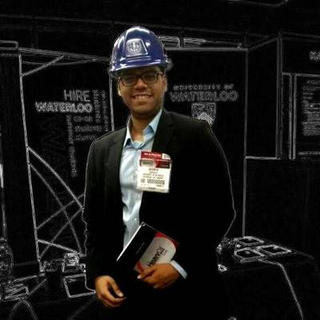
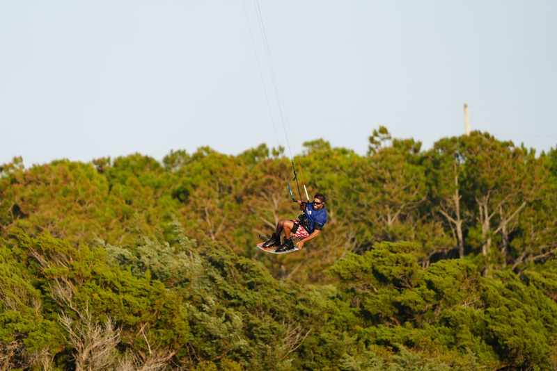
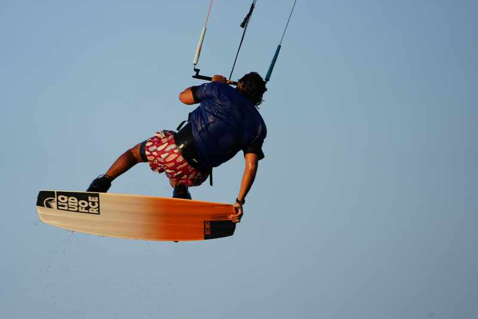

:::::: {.bs-page-shell}
::::: {.bs-reading-column}

::: {.ter-about-intro}
::: {.ter-about-portrait}
{fig-alt="Andrew Andrade" loading="lazy"}
:::

::: {.ter-about-intro-copy}
## Hi, I'm Andrew Andrade, B.A.Sc., B.Ed., OCT.

I teach Technological Education at Port Credit Secondary School. I am still learning how to do this work well, and this site is one way of making the lessons, assignments, slides, experiments, and revisions useful beyond a single classroom.

The resources are organized around Ontario's [Technological Education curriculum](https://www.dcp.edu.gov.on.ca/en/curriculum/technological-education), with connections to other curricular and co-curricular learning where they are useful.
:::
:::

## A little background

Before teaching at Port Credit, I worked at Palantir, ran a startup called PetroPredict, and completed internships at Facebook, Suncor, and several smaller technology companies. Earlier, while I was still in high school, I worked as a lifeguard and deck supervisor with the City of Mississauga and in a machine shop after a co-op placement.

Outside work and school, I was a sponsored kiteboarder for **Switch Kites** and have been an avid **box lacrosse** player. Those experiences are part of why I value hands-on learning, practice, teamwork, risk awareness, and learning from people who know something you do not.

::: {.ter-kite-grid}
{fig-alt="Andrew Andrade kiteboarding over the shoreline" loading="lazy"}

{fig-alt="Andrew Andrade kiteboarding with the board in the foreground" loading="lazy"}
:::

## Why this site is open

The goal is simple: make useful teaching and learning material available to **learners, educators, and anyone else who can use it**, without putting basic knowledge behind a paywall or inside one classroom.

This approach is influenced by open education projects such as Tony R. Kuphaldt's [Socratic Electronics](https://www.ibiblio.org/kuphaldt/socratic/), which emphasizes learning through questions, research, discussion, explaining ideas to others, and developing the ability to teach yourself.

The material here is meant to be used, questioned, adapted, improved, and shared again.

## A few ideas worth carrying

These are short reminders rather than a teaching philosophy carved in stone.

> **"Let us not take thought for our separate interests, but let us help one another."**  
> [OSSTF/FEESO motto](https://www.osstf.on.ca/en-CA/about-us/what-we-stand-for/principles.aspx)

> **"A person is a person through other persons."**  
> A common English rendering of the [Ubuntu](https://www.ubuntuleadersacademy.org/en/o-ubuntu-en/foundation) idea *umuntu ngumuntu ngabantu*

> **"Each one, teach one."**  
> A [literacy phrase](https://education.arizona.edu/each-one-teach-one) associated with passing knowledge forward

> **Lux numquam desit.**  
> Port Credit's school motto: a reminder to keep light, learning, and useful knowledge moving forward.

Together they point toward the same practical idea: learning is individual work, but it does not have to be solitary work.

## Open licences and attribution

Original educational text, lessons, diagrams, slides, and explanatory material on this site are released under **[Creative Commons Attribution-ShareAlike 4.0](https://creativecommons.org/licenses/by-sa/4.0/)**. You can copy and adapt them, including for your own classes, as long as you provide attribution and share adaptations under the same or a compatible licence.

Original website code, scripts, build tooling, and other executable materials are released under the **[GNU Affero General Public License v3](https://www.gnu.org/licenses/agpl-3.0.html)**.

A simple attribution is enough:

> Based on material from **Technological Education Resources** by Andrew Andrade and contributors. Licensed under **CC BY-SA 4.0**. Changes were made.

Third-party images, quotations, fonts, logos, and other materials keep their own licences and attribution requirements. The [Licensing and Attribution](licensing.qmd) page has the fuller details.

## The visual identity

The visual system grew from the colours and visual language around Port Credit Secondary School, including the lighthouse, harbour, school technology programs, and the surrounding community. The working palette is intentionally restrained so documents, slides, worksheets, and web pages remain readable in classrooms and when printed.

These resources are independently created teaching materials. They should not be read as official publications of Port Credit Secondary School, the Peel District School Board, or the Ontario Ministry of Education.

## Contributors

This project currently reflects my classroom work and the people whose ideas, feedback, and resources have influenced it. As others contribute directly to the site, **contributor bios will be added here**.

[LinkedIn](https://www.linkedin.com/in/andrewandrade) · [GitHub](https://github.com/mrandrewandrade) · [Personal site](https://andrewandrade.ca/)

:::::
::::::
