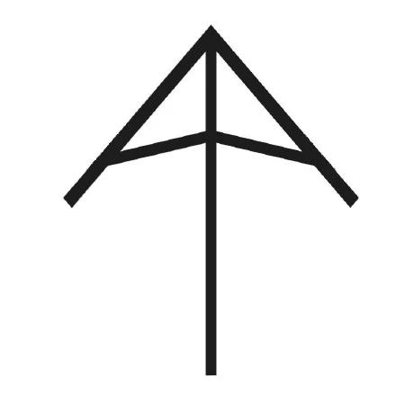
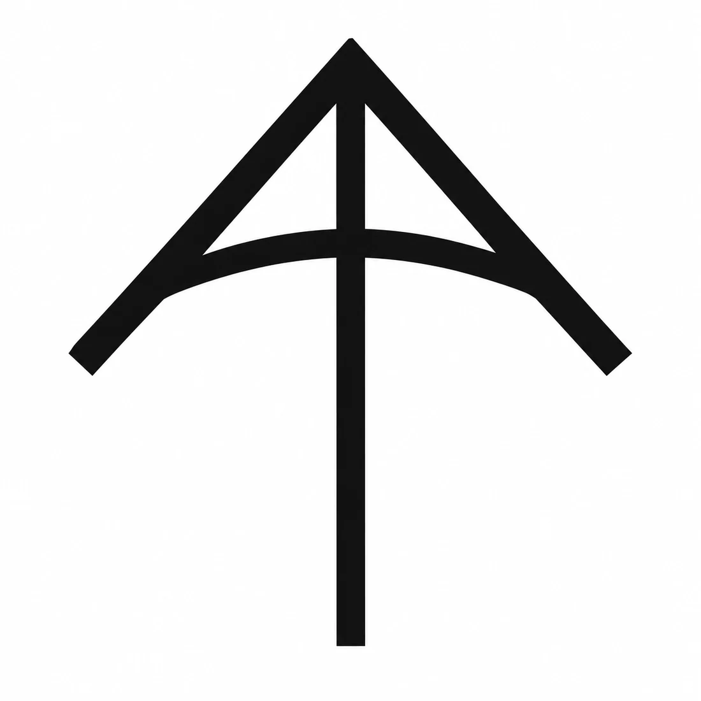
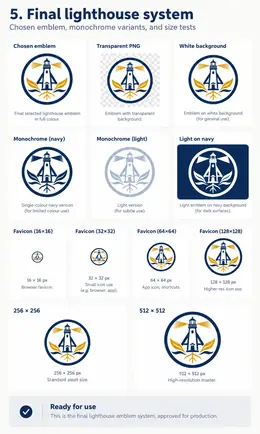

::: {.bs-editorial-lead}
I first made my AA mark while I was in university. The useful lesson is not the final image. It is how the identity changed as I changed, kept drawing, tested ideas, removed things, and added meaning.
:::

## A personal logo should stay simple

My original AA mark came from university. It was thin, angular, and easy to draw by hand.

{fig-alt="The original thin, angular AA personal mark made in university."}

Years later, I changed it because I had changed. As I evolved as an educator and became more mature, I wanted the mark to feel less sharp and more supportive. I made the strokes heavier and curved the cross-arms.

{fig-alt="A heavier AA monogram with curved cross-arms."}

The curve feels more supportive than a straight bar. It can suggest an arch, a truss, an umbrella, part of a circle, an arrow, or the leading edge of a kite. Those references matter to me, but the logo does not need to explain all of them to everyone who sees it.

That is the point of a **personal logo**. It should be simple, memorable, reproducible, and recognizable at a small size. It should represent you without trying to tell your entire life story.

## Identity can change without rejecting where it came from

I am a disciple of Jesus, and I worship one God in three persons: the Father, the Son, and the Holy Spirit.

My own emphasis has changed over time. Earlier, I thought most about God as Creator. Later, I focused more on Jesus, the Son, who lived on earth and showed what faith could look like in a human life. More recently, I have tried to honour the Holy Spirit, whom I believe lives and works in each person. That has pushed me to think more about dignity, relationship, service, community, and how I treat the people around me.

My Christian faith is my own foundation, but I also want to keep learning about the religions, philosophies, and spiritual traditions represented by the people around me. As an educator, I want to understand students better, including the beliefs, practices, stories, and values that may be important to them. That means listening with respect rather than assuming that everyone sees meaning, community, duty, suffering, nature, or the sacred in the same way I do.

I find wisdom worth studying in many ancient traditions. Indigenous teachings about responsibility to future generations, including the Seven Generations principle, challenge me to think beyond the immediate moment. Taoism's attention to balance, humility, and living in relationship with the natural world resonates with me. Buddhism raises powerful questions about compassion, attachment, suffering, and attention. Judaism carries a deep tradition of study, questioning, covenant, memory, and responsibility. Sikhism emphasizes service, equality, courage, and community. Islam offers rich traditions of prayer, charity, discipline, mercy, and submission to God. Hindu traditions contain diverse teachings about duty, knowledge, devotion, action, and the nature of reality. I also want to learn from Jainism, the Bahá'í Faith, humanist traditions, and other ways people have tried to understand how to live well with one another.

I do not see these traditions as interchangeable, and learning about them does not require me to give up my own beliefs. It helps me approach other people with more curiosity and less certainty about what their experience must be. In a classroom, that matters. Students should be able to bring different identities and beliefs into the same shared space while still working, learning, building, questioning, and treating one another with dignity.

Those beliefs and influences are part of who I am, but a public educational identity does not need to explain all of them literally. Instead, some of those ideas can appear more indirectly through forms that suggest guidance, support, light, growth, roots, water, connection, and place.

## Selected images

The experiments are part of the design. I made many versions, including some that were more like abstract art than logos. A few selected images are enough to show how the thinking changed without turning the page into a complete archive.

> **Image placeholder: Black-and-white exploration**
>
> A selected abstract black-and-white exploration of the AA geometry.

> **Image placeholder: Black-and-white circular stamp**
>
> A circular black-and-white version that reads more like a stamp, seal, or crest.

{fig-alt="A chronological sequence of Commons lighthouse emblem iterations."}

> **Image placeholder: Selected explorations**
>
> A small set of the strongest intermediate directions before the final emblem was chosen.

The black-and-white work helped me judge shape without depending on colour, texture, glow, or shading. Some experiments were visually interesting but poor logos. If a design becomes unreadable at favicon size or depends on effects to work, it may be better understood as an illustration or piece of abstract art than as a logo.

## From a personal logo to a Commons emblem

The larger symbol is doing a different job. It represents **Technology Commons**, not just me, so it can carry more information than the AA logo.

The current emblem combines several ideas:

- the **AA structure** represents my authorship and support for the Commons
- the **lighthouse** connects to Port Credit Secondary School and suggests guidance and stewardship
- the **rocket-like upward form** connects the identity to science, technology, engineering, and aspiration
- the **water** connects to Port Credit, flow, movement, and learning
- the **roots** suggest heritage, growth, and a foundation that can exist even below the visible waterline
- the enclosing **circle** makes the image read as a shared organizational emblem rather than only a personal monogram

The lighthouse, leaves, roots, waves, and light did not arrive at once. Early versions added too much. Other versions became so simple that they lost the character I wanted. The current version sits between those extremes.

## The final lighthouse system

The selected emblem also has to work as a system, not only as one full-colour image. It needs transparent and white-background versions, monochrome versions for limited-colour use, a reversed version for dark surfaces, and small-size exports for icons and favicons.

This is the end point of the emblem work for now. The images above should show how the design got here without pretending every experiment was equally important.

For students, that is the part worth copying. Start with a mark you can draw. Make several versions. Keep the rejected ideas. Test everything in black and white and at small size. Then decide whether you are making a **personal logo**, which should remain compact, or an **emblem for an organization, product, project, or community**, which may have room to carry a larger story.

The first sketch and the final emblem matter. Most of the design happened between them.
