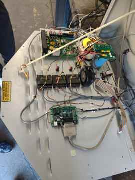
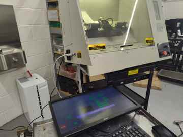

::: {.bs-editorial-lead}
Mr. Knowles used to joke that my cohort was **"Iteration 1"**, the first group through the program. Many of us went on to engineering at Waterloo, U of T, and elsewhere.
:::

This year, my own Iteration 1 has graduated and started university. I want to record some of what they accomplished, especially for anyone looking for co-op students or interns.

## Robert Abraham

In Grade 11 Computer Engineering, Robert took the initiative to work on an old Lab-Volt CNC lathe that another high school was going to throw out.

{fig-alt="An older enclosed Lab-Volt CNC lathe in a school technology shop with the front enclosure open."}

When we opened the electronics cabinet, the wiring was difficult to trace and did not consistently follow convention, including black being used as positive on part of the DC circuit.

{fig-alt="Open CNC lathe electronics cabinet showing circuit boards, power electronics, Gecko motor drives, wiring, and a replacement motion-control board."}

Robert researched a replacement controller compatible with the existing Gecko drives, and we worked through the electrical and mechanical problems. The mechanical work meant disassembling parts of the machine, cleaning them, resolving issues, and putting everything back together.

We also ended up running the machine with **LinuxCNC**, which meant setting up a Linux-based controller computer and operating system as part of the retrofit.

{fig-alt="A Lab-Volt CNC lathe connected to a computer displaying the LinuxCNC machine-control interface."}

We did not have another Mastercam licence available either. Robert learned Autodesk Inventor, generated the G-code, and kept pushing until the machine ran a program.

By Christmas, less than a semester after starting, we cut our first part: a Christmas tree.

That project is a good example of what I want computer engineering to be: not just following instructions, but inheriting a broken system, researching what you do not know, and making it work.

[See more of Robert Abraham's projects](http://robert-abraham.com/projects).
