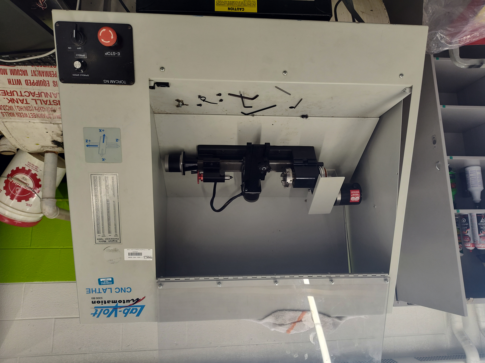
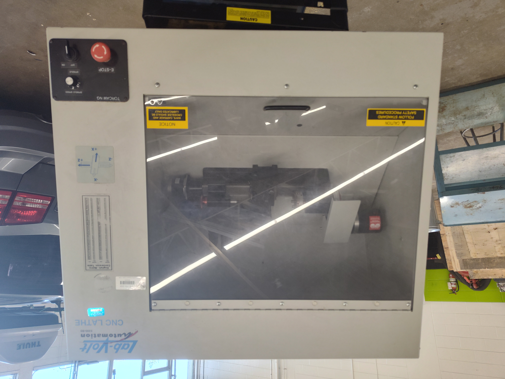

::: {.bs-editorial-lead}
Mr. Knowles used to joke that my cohort was **"Iteration 1"**, the first group through the program. Many of us went on to engineering at Waterloo, U of T, and elsewhere.
:::

This year, my own Iteration 1 has graduated and started university. I want to record some of what they accomplished, especially for anyone looking for co-op students, interns, or part-time technical help.

The important context for these stories is that **this was not simply the assigned course work**. These students did the regular work, did it to a high standard, and then chose problems that interested them and went much further. The best description is probably an impressive engineering **side quest**: the main quest was already complete.

<iframe
  src="https://www.youtube.com/embed/2x7b4WiCxzU"
  title="Robert Abraham CNC lathe project"
  style="display: block; width: 100%; aspect-ratio: 9 / 16; border: 0;"
  allow="accelerometer; autoplay; clipboard-write; encrypted-media; gyroscope; picture-in-picture; web-share"
  allowfullscreen>
</iframe>

## Robert Abraham

Introducing **Robert Abraham**, now studying Computer Engineering at the University of Toronto. You can find more about him and his projects at [robert-abraham.com/projects](https://robert-abraham.com/projects).

In Grade 11 Computer Engineering, Robert took the initiative to work on an old Lab-Volt CNC lathe that another high school was going to throw out. Restoring it was not an assigned project. He saw a difficult, open-ended problem and decided to take it on. Before Christmas, we were already machining our first part: a Christmas tree. Here is how it happened.

{fig-alt="An older Lab-Volt CNC lathe being disassembled in a school technology shop."}

When we opened the electronics cabinet, the wiring was difficult to trace and did not consistently follow convention, including black being used as positive on part of the DC circuit.

{fig-alt="Open CNC lathe electronics cabinet showing circuit boards, drives, wiring, and power electronics."}

Robert researched a replacement controller compatible with the existing Gecko drives, and we worked through the electrical and mechanical problems. The mechanical work meant disassembling parts of the machine, cleaning them, resolving issues, and putting everything back together.

The **broken controller was the only component we had to replace**. Everything else was done using what we already had, open-source software, or software available free through student educational access.

We ran the machine with **LinuxCNC**, so part of the retrofit meant setting up and configuring our own Linux-based controller computer and operating system. LinuxCNC gave us an open-source machine-control platform without needing to buy proprietary CNC control software.

{fig-alt="A CNC lathe connected to a computer displaying the LinuxCNC machine-control interface."}

We did not have another Mastercam licence available either. Robert learned Autodesk Inventor through educational access, generated the G-code, and kept pushing until the machine ran a program.

{fig-alt="The finished enclosed Lab-Volt CNC lathe after its restoration and control-system retrofit."}

That project is a good example of what I want computer engineering to be: not just following instructions, but inheriting a broken system, researching what you do not know, and making it work. The impressive part was not that Robert completed an assignment. It was that he chose to go well beyond one.

**Posted with Robert's permission.** If you are looking for an intern, co-op student, or someone for part-time technical work, consider reaching out to him.
